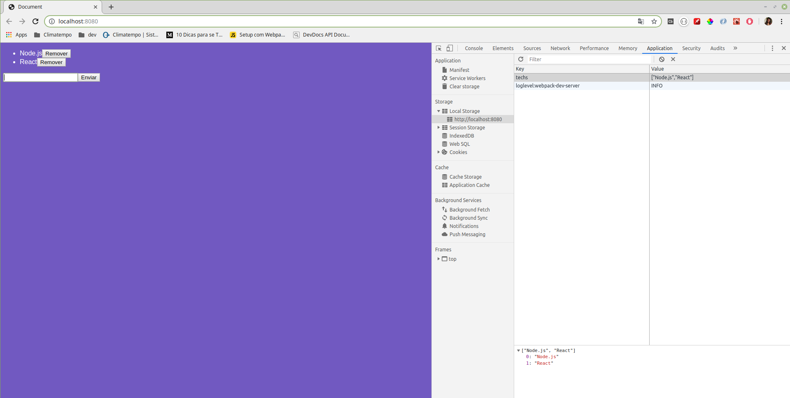

# Módulo 4 - Introdução ao React

- Conceitos do React;
- Configurando estrutura;
- Criando componente raiz;
- Importando CSS;
- Importando imagens;
- Class Components;
- Estado & Imutabilidade;
- Removendo itens do estado;
- Propriedades do React;
- Default Props & PropTypes;
- Ciclo de vida do componente;

 
